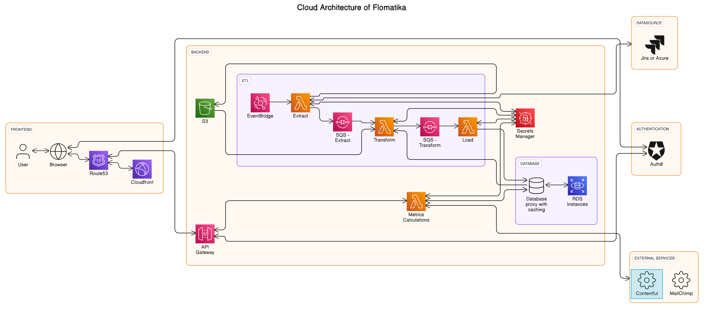
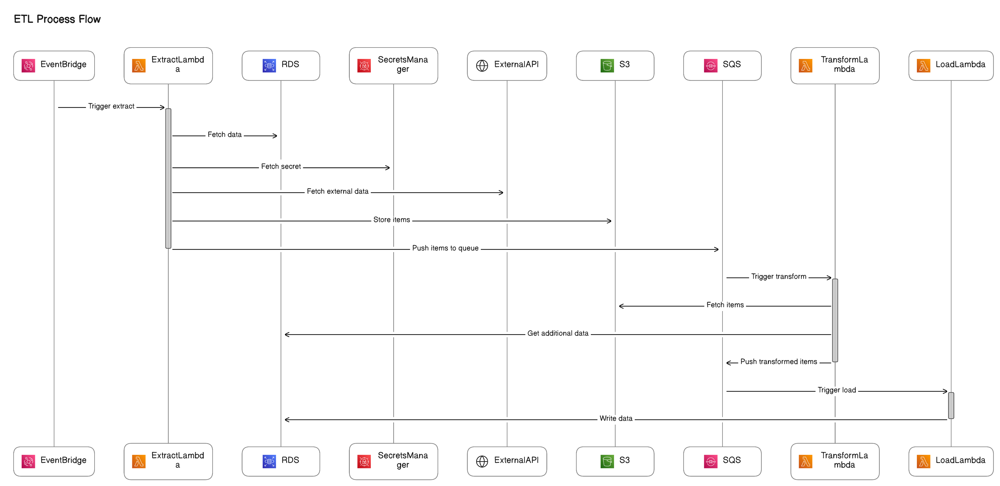

# README
Thank you for exploring our ETL (Extract, Transform, Load) repository! This repository utilizes a serverless architecture, employing SQS queues, SNS events, and schedules to orchestrate the ETL process.

This documentation is our best effort to provide insight into the architecture and workflow of our repository. Given the complexity and extensive history of our work, creating comprehensive documentation is challenging, but we've strived to offer the best possible guidance.

The commit history has been removed because it contained sensitive information that we could not include in this open-source repository. We realize that this makes it harder to understand certain technical decisions without commit messages, as you lose some context. We unfortunately had to do it.

We'd also like to inform you that certain sections of the codebase have been modified when transitioning it into an open-source project to address security, data, legal, and privacy concerns. This might potentially affect immediate functionality, and we apologize for any inconvenience this may cause.

We hope you're familiar with Serverless architecture, TypeScript, and AWS services, as your expertise in these areas can be really helpful in tackling any issues that come up. Should issues arise, we kindly suggest utilizing this readme file as a resource for troubleshooting and debugging independently.

Feel free to explore the codebase to understand its workings better, especially if things don't work as expected. We suggest tackling the lambdas one by one instead of trying to get the entire project to work all at once. Take it step by step.


## Serverless Configuration
The configuration of the serverless architecture resides in the serverless.yml file. For insights into the configuration setup, please refer to the [Serverless Framework Documentation](https://www.serverless.com/framework/docs).

## ETL Workflow
Our ETL process comprises multiple stages:

- **Schedulers**: These components manage the scheduling and extraction tasks. When triggered, they invoke the extractor, utilizing either SQS or SNS. For details on event handling, please refer to the lambda definition's "events" section in the `serverless.yml`.
  
- **Extractor**: Responsible for fetching data from the datasource.
  
- **Transformer**: This stage converts the extracted data into our desired data model. It involves leveraging the configuration set by the user in the wizard UI (refer to the frontend repository for more details on the wizard) to compute specific attributes of the items.
  
- **Loader**: The transformed items are then persisted into the database.

Data communication between stages is facilitated through either an SQS queue or SNS mechanism. To understand which mechanism is used to invoke the function, you can refer to the `events` section of the lambda function in the  `serverless.yml` file.


## Installation

To ensure compatibility and manage Node version effectively, it's recommended to use a version manager such as [NVM](https://github.com/nvm-sh/nvm#nvmrc) or [FNM](https://github.com/Schniz/fnm). Once you have set up your version manager, follow these steps:

1. Set Node version 20 using your preferred version manager:

   ```bash
   nvm use 20
   ```

   or

   ```bash
   fnm use 20
   ```

2. With Node version 20 activated, install project dependencies using npm:

   ```bash
   npm install
   ```

This approach ensures that your project dependencies are installed with Node version 20, allowing for smoother compatibility and execution. If you encounter any issues with specific packages, you can experiment with different Node versions to find the most suitable one for your project.

## Run ETL locally
Running ETL processes locally involves several manual changes to files and setting up environment variables correctly. Follow these steps carefully to ensure smooth execution
### Setup env

- Add this to the .env file. This is only for running ETL locally. Do not commit this. Refer to `.env.example` file.
   ```
   AWS_ACCESS_KEY_ID=<YOUR_AWS_ACCESS_KEY_ID>
   AWS_SECRET_ACCESS_KEY=<YOUR_AWS_SECRET_ACCESS_KEY>
   AWS_DEFAULT_REGION=<YOUR_AWS_DEFAULT_REGION>
   AWS_REGION=<YOUR_AWS_REGION>

   DATABASE_HOST=<YOUR_DATABASE_HOST>
   DATABASE_PASSWORD=<YOUR_DATABASE_PASSWORD>

   LOCAL_DATABASE_CREDENTIALS=true
   IS_OFFLINE=true
   LOCAL_DEBUG=true

   JC_TOKEN=<TOKEN>
   AB_TOKEN=<TOKEN>
   KANBANIZE_TOKEN=<TOKEN>

   ETL_LOCAL_BUCKET_PATH=/tmp/local-bucket 
   ETL_IS_DEV=true
   ETL_USE_LOCAL_S3=true

   ETL_ORG_ID=<ORG_ID>                  
   ETL_DATASOURCE_ID=<DATASOURCE_ID>   

   AUTH0_M2M_API_CLIENT_ID=<AUTH0_CLIENT_ID>
   AUTH0_M2M_API_CLIENT_SECRET=<AUTH0_CLIENT_SECRET>
   ```

   *To better understand what each variable does in the code, you can use VS Code's Ctrl+Shift+F shortcut for a global search. This helps you find where each variable is used throughout the codebase, making it easier to grasp their purposes and how they work in the code.*

When running the ETL process locally, certain environment variables need to be set to ensure proper functionality. These variables are as follows:

- **Database Configuration**:
  - `DATABASE_HOST`: The host address of your database.
  - `DATABASE_PASSWORD`: The password for accessing your database.

- **Local Environment Flags**:
  - `LOCAL_DATABASE_CREDENTIALS`: Set this to `true` to indicate the use of a local credentials for the database.
  - `IS_OFFLINE`: Set this to `true` to simulate an offline environment.
  - `LOCAL_DEBUG`: Set this to `true` to enable local debugging features.

  *Those three variables serve a similar purpose, indicating whether the application is running locally or in production. Over time, multiple variables emerged, leading to redundancy and decreased clarity. Consolidating these variables into a single one would enhance clarity and simplify management, addressing this technical debt.*

  - `JC_TOKEN`: Token for extarcting data from Jira.
  - `AB_TOKEN`: Token for extarcting data from Azure boards.
  - `KANBANIZE_TOKEN`: Token for accessing Kanbanize data (note: this extractor is experimental and has not been deployed to production).
  - `ETL_LOCAL_BUCKET_PATH`: Path to the local bucket where ETL data will be stored.
  - `ETL_IS_DEV`: Set this to `true` to indicate development mode.
  - `ETL_USE_LOCAL_S3`: Set this to `true` to use a local folder inplace of AWS S3 storage.
  - `ETL_ORG_ID`: The ID of the organization.
  - `ETL_DATASOURCE_ID`: The ID of the datasource.

   *Ensure these variables are properly configured in your local environment to run the ETL process smoothly. When `ETL_IS_DEV` is set to `true`, the codebase will adapt its behavior for local development.*

- When running your serverless application locally, it's essential to streamline the execution by focusing only on specific functions. This can be achieved by adjusting the events configuration in your `serverless.yml` file.

- Example Configuration: To ensure that functions are not invoked on schedule when running locally, you can comment out the scheduled events and enable HTTP events instead.

   ```yaml
   functions:
   yourFunctionName:
      handler: path/to/your/function.handler
      events:
         # - schedule:
         #     name: your-schedule-name
         #     description: 'Your schedule description'
         #     rate: cron(0 0 * * ? *)
         - httpApi:
            path: /your-path
            method: GET
   ```

- Before proceeding, execute the following command in a separate terminal window. This command sets up a local server that emulates AWS SQS and SNS functionality, enabling you to replicate the behavior of these services locally and trigger lambda functions using queues and events 
   ```
   docker run -p 9324:9324 -p 9325:9325 -v `pwd`/sqs-offline.conf:/opt/elasticmq.conf softwaremill/elasticmq-native
   ```

- Start services offline
   ```
   npm run offline
   ```

## Database
This project is designed to work with a PostgreSQL database. While Sequelize is predominantly utilized for interacting with the database, there are instances where direct SQL queries are employed.

For setting up the required tables in PostgreSQL, you can execute the SQL script located at ./sql/full_ddl.sql. This script contains the Data Definition Language (DDL) statements necessary to create the tables required for the ETL process.

Make sure to execute this SQL script in your PostgreSQL environment to create the tables needed for the ETL operations to function properly.

## Architecture
- Architecture

- ETL Process Flow


## Additional Resources
- For comprehensive understanding of the serverless configuration, please consult the [Serverless Framework Documentation](https://www.serverless.com/framework/docs).
- Dive deeper into the ETL workflow and its components by exploring our codebase.


